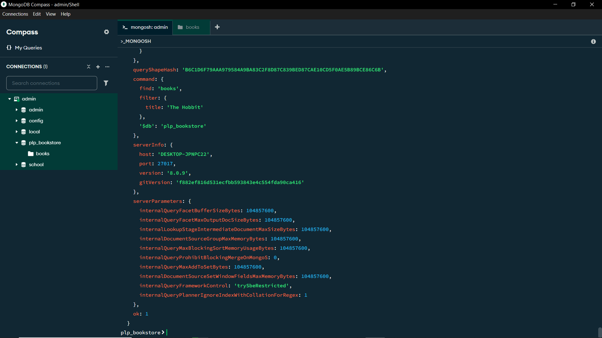

<!-- 
# MongoDB Fundamentals Assignment

This assignment focuses on learning MongoDB fundamentals including setup, CRUD operations, advanced queries, aggregation pipelines, and indexing.

## Assignment Overview

You will:
1. Set up a MongoDB database
2. Perform basic CRUD operations
3. Write advanced queries with filtering, projection, and sorting
4. Create aggregation pipelines for data analysis
5. Implement indexing for performance optimization

## Getting Started

1. Accept the GitHub Classroom assignment invitation
2. Clone your personal repository that was created by GitHub Classroom
3. Install MongoDB locally or set up a MongoDB Atlas account
4. Run the provided `insert_books.js` script to populate your database
5. Complete the tasks in the assignment document

## Files Included

- `Week1-Assignment.md`: Detailed assignment instructions
- `insert_books.js`: Script to populate your MongoDB database with sample book data

## Requirements

- Node.js (v18 or higher)
- MongoDB (local installation or Atlas account)
- MongoDB Shell (mongosh) or MongoDB Compass

## Submission

Your work will be automatically submitted when you push to your GitHub Classroom repository. Make sure to:

1. Complete all tasks in the assignment
2. Add your `queries.js` file with all required MongoDB queries
3. Include a screenshot of your MongoDB database
4. Update the README.md with your specific setup instructions

## Resources

- [MongoDB Documentation](https://docs.mongodb.com/)
- [MongoDB University](https://university.mongodb.com/)
- [MongoDB Node.js Driver](https://mongodb.github.io/node-mongodb-native/)  -->

# 📚 MongoDB Bookstore Scripts

This project provides MongoDB scripts for managing a `plp_bookstore` database and its `books` collection.

## 🛠 Requirements

Make sure you have the following installed:

- [Node.js](https://nodejs.org/) (v18 or newer recommended)
- [MongoDB](https://www.mongodb.com/) running locally or via MongoDB Atlas
- MongoDB Node.js driver (`mongodb` package)

## 📁 Files

- `insert_books.js` — Script to insert sample books into the database
- `queries.js` — Script to perform various queries and operations on the books collection

## 🚀 Setup & Usage

### 1. Install Dependencies

Navigate to your project directory and install the MongoDB driver:

npm install mongodb

2. Update MongoDB Connection URI (if needed)

Make sure both scripts use the correct MongoDB connection URI:

const uri = "mongodb://localhost:27017"; // Change if using MongoDB Atlas

If you're using MongoDB Atlas, your URI will look like:

const uri = "mongodb+srv://<username>:<password>@cluster0.mongodb.net/?retryWrites=true&w=majority";

3. Run the Scripts

Use Node.js to run the scripts:

node insert_books.js     # Adds sample books to the 'plp_bookstore' database
node queries.js          # Runs queries (find, update, delete, aggregate, etc.)

💡 Functionality Overview
insert_books.js

    Connects to plp_bookstore

    Inserts an array of books with fields like title, author, published_year, price, genre, in_stock, page, and publisher

queries.js

    Find books by:

        Genre

        Author

        Publication year

        In-stock status

    Update book prices

    Delete books by title

    Use projection, sorting, pagination

    Run aggregation pipelines (average price by genre, group by decade, etc.)

    Create and drop indexes

    Use explain() to analyze performance

🔧 Example Index Commands (via queries.js or Mongo Shell)

// Create indexes
db.books.createIndex({ title: 1 })
db.books.createIndex({ author: 1, published_year: -1 })

### A screenshot of your MongoDB Compass showing your collections and sample data
